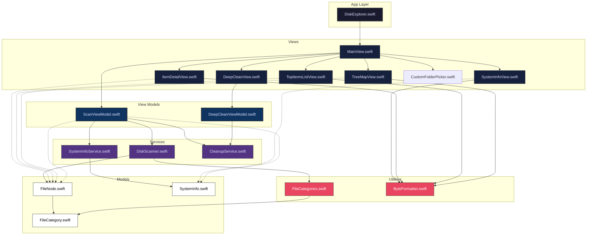

# Disk Explorer

Disk Explorer is a sleek, modern, and native macOS application designed to help you visualize and reclaim your disk space. Built entirely with SwiftUI, it offers a blazing-fast, visually stunning alternative to traditional disk analyzers.

## Architecture & Data Flow

Disk Explorer is designed with a clear separation of concerns, heavily utilizing Swift's concurrency (`async/await`, `Task`, `Sendable`) and Combine (`ObservableObject`, `@Published`) paradigms. 



### 1. View Layer (SwiftUI)
The presentation layer is strictly declarative. The `MainView` handles structural routing, acting as the primary host for the `ScanViewModel`. Subviews (`TreeMapView`, `TopItemsListView`, `ItemDetailView`) are passed specific isolated states (like the selected `FileNode`). 
- **`TreeMapView`**: Implements a squarified treemap layout algorithm dynamically computing layout bounds through `GeometryReader`.
- **`TopItemsListView`**: Displays the largest items utilizing a highly optimized, iterative tree-traversal array mechanism. By migrating away from recursive functions into an iterative stack implementation on detached background tasks, we strictly prevent thread stack overflows when analyzing deeply nested node trees. 
- **`ItemDetailView`**: Presents an edge-to-edge inspector pane utilizing a `NavigationSplitView` architecture. To bypass restrictive macOS `NSVisualEffectView` Vibrancy blending engine (which often washes out standard `.bordered` buttons atop `.regularMaterial`), we deploy custom `.plain` button styles with strict opaque rendering parameters. Integrates deeply with the macOS environment, invoking `NSWorkspace.shared.open` and `@Environment(\.openURL)` to bridge native web searches and Finder revelation commands dynamically.
- **`CustomFolderPicker`**: A borderless, movable, glassmorphic window designed specifically to bypass Sequoia `NSOpenPanel` freeze. It dynamically queries iCloud Drive and other directories in the sidebar, utilizes a custom 0ms latency tap gesture system for instant selection response, and matches native Finder window layouts.

### 2. ViewModel Layer
The ViewModels orchestrate communication between background services and the main UI thread. They utilize modern Swift 6 `@Observable` macros for highly efficient, granular UI updates.
- **`ScanViewModel`**: Tracks the recursive file tree state. Triggers scans using background `Task` logic and handles breadcrumb navigation logic. 
- **`DeepCleanViewModel`**: Manages isolated state for specific cleanup paths, dynamically tracking physical file size via non-blocking enumerators and safely destroying data.

### 3. Service Layer
- **`DiskScanner`**: A highly parallelized service utilizing `FileManager.enumerator` and Swift 6 `Synchronization.Mutex` for thread-safe state management. Calculates sizes utilizing native `allocatedFileSizeKey` to capture true blocks-on-disk measurements.
- **`CleanupService`**: Delegates recoverable Trash operations to Finder on a background serial queue. This uses Finder's File Provider-aware path for iCloud Drive and other cloud-backed locations without blocking the SwiftUI main actor.
- **`SystemInfoService`**: Interfaces tightly with standard macOS Darwin layers and `URLResourceValues` to track true device capacity dynamically.

### 4. Models
- **`FileNode`**: The fundamental data unit forming a tree. Implemented as a highly-efficient value-type `struct` conforming to `Identifiable`, `Hashable`, and `Sendable`.

## Features

- **Interactive Treemap**: A beautiful, glassmorphic visual representation of your disk space. The larger the block, the more space it consumes. Double-click to drill down into folders, and freely navigate your history with the dynamic breadcrumb bar. The visual map dynamically morphs between rendering structural folder hierarchies and rendering flat files depending on your "Files Only" vs "Folders Only" selection! Features a highly visible highlight system to track selections across the UI.
- **Category Histogram**: A responsive stacked bar chart that breaks down your storage by file type (Applications, Documents, Developer files, System Caches, etc.).
- **Largest Items List**: Instantly see the largest individual files and folders within any directory, complete with inline visual histogram bars representing their relative sizes. Also correctly delineates deep firmlinks, rendering both standard logical bounds and underlying physical data routes.
- **Safety First Design**: Built-in protections automatically disable deletion functionality for critical OS `.system` files, preventing accidental data loss.
- **Deep Clean**: A dedicated dashboard to safely find and permanently delete gigabytes of hidden system junk, user caches, logs, Xcode derived data, and Trash. Notifies root models synchronously on completion to instantly trigger graphical re-renders of disk capacity.
- **Custom Folder Picker**: Designed to bypass macOS Sequoia dialog freezes. It displays cloud locations (iCloud Drive, OneDrive, Google Drive), internal and external volumes, and supports instant 0ms row selections via custom gesture mapping.
- **Drag & Drop Scan**: Supports dragging any folder or drive from Finder directly into the ready-to-scan window view to initiate scans instantly.

## Installation & Building

Disk Explorer is distributed as a Swift Package that builds into a standalone macOS `.app` bundle.

### Prerequisites
- macOS 15.0 or later
- Xcode 16+ or the Swift 6.0 Command Line Tools installed

### How to Install & Run

1. **Clone or Download** the repository.
2. **Run the Build Script**:
   Open Terminal, navigate to the project folder, and run:
   ```bash
   ./build.sh
   ```
   *Note: If you get a permission error, make the script executable first by running `chmod +x build.sh`.*

3. **Launch the App**:
   The script compiles the Swift code, creates the signed bundle, and installs it at `~/Applications/Disk Explorer.app`. Launch that local copy rather than creating or running an app bundle inside a cloud-synced source folder.

### Permissions
Upon first launch, navigate to **Disk Explorer > Settings** (`Cmd + ,`) and follow the instructions to grant the app **Full Disk Access**. This ensures the scanner can see protected locations. On the first Move to Trash action, macOS may separately ask for permission to control Finder; allow it under **System Settings > Privacy & Security > Automation**.

For the File Provider failure analysis, implementation details, permissions, and troubleshooting steps, see [Trashing Files and Folders Safely](docs/trashing-fileprovider-items.md).
