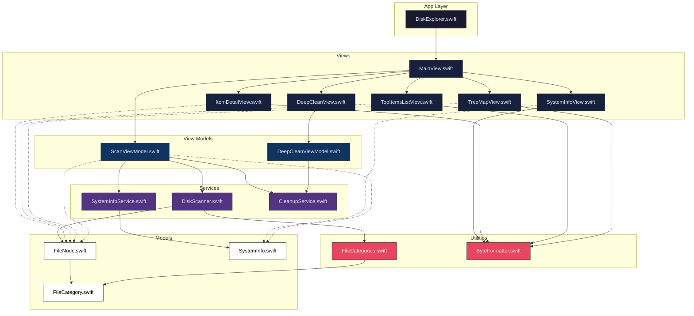

# Disk Explorer

Disk Explorer is a sleek, modern, and native macOS application designed to help you visualize and reclaim your disk space. Built entirely with SwiftUI, it offers a blazing-fast, visually stunning alternative to traditional disk analyzers.

## Architecture & Data Flow

Disk Explorer is designed with a clear separation of concerns, heavily utilizing Swift's concurrency (`async/await`, `Task`, `Sendable`) and Combine (`ObservableObject`, `@Published`) paradigms. 



### 1. View Layer (SwiftUI)
The presentation layer is strictly declarative. The `MainView` handles structural routing, acting as the primary host for the `ScanViewModel`. Subviews (`TreeMapView`, `TopItemsListView`, `ItemDetailView`) are passed specific isolated states (like the selected `FileNode`). 
- **`TreeMapView`**: Implements a squarified treemap layout algorithm dynamically computing layout bounds through `GeometryReader`.
- **`VSplitView`**: Uses macOS native split view structures to dynamically allocate screen real-estate between the visual map and list representation.

### 2. ViewModel Layer
The ViewModels orchestrate communication between background services and the main UI thread.
- **`ScanViewModel`**: Tracks the recursive file tree state. Triggers scans using background `Task` logic and handles breadcrumb navigation logic. 
- **`DeepCleanViewModel`**: Manages isolated state for specific cleanup paths, dynamically tracking physical file size via non-blocking enumerators and safely destroying data.

### 3. Service Layer
- **`DiskScanner`**: A highly parallelized service utilizing `FileManager.enumerator`. Importantly, it bypasses standard Apple API firmlink obfuscation by manually passing and constructing physical directory paths dynamically, ensuring accuracy across volumes. Calculates sizes utilizing native `allocatedFileSizeKey` to capture true blocks-on-disk measurements.
- **`CleanupService`**: Uses `NSWorkspace` to securely bypass sandbox constraints and perform unrecoverable `.Trash` relocation routines.

### 4. Models
- **`FileNode`**: The fundamental data unit forming a tree. It natively conforms to `Identifiable` and `Hashable`.

## Features

- **Interactive Treemap**: A beautiful, glassmorphic visual representation of your disk space. The larger the block, the more space it consumes. Click to drill down into folders. Features a highly visible highlight system to track selections across the UI.
- **Category Histogram**: A responsive stacked bar chart that breaks down your storage by file type (Applications, Documents, Developer files, System Caches, etc.).
- **Largest Items List**: Instantly see the largest individual files and folders within any directory, complete with inline visual histogram bars representing their relative sizes. Also correctly delineates deep firmlinks, rendering both standard logical bounds and underlying physical data routes.
- **Safety First Design**: Built-in protections automatically disable deletion functionality for critical OS `.system` files, preventing accidental data loss.
- **Deep Clean**: A dedicated dashboard to safely find and permanently delete gigabytes of hidden system junk, user caches, logs, Xcode derived data, and Trash. Notifies root models synchronously on completion to instantly trigger graphical re-renders of disk capacity.

## Installation & Building

Disk Explorer is distributed as a Swift Package that builds into a standalone macOS `.app` bundle.

### Prerequisites
- macOS 13.0 or later
- Xcode or the Swift Command Line Tools installed

### How to Install & Run

1. **Clone or Download** the repository.
2. **Run the Build Script**:
   Open Terminal, navigate to the project folder, and run:
   ```bash
   ./build.sh
   ```
   *Note: If you get a permission error, make the script executable first by running `chmod +x build.sh`.*

3. **Launch the App**:
   The script will compile the Swift code and bundle it into `Disk Explorer.app`. You can double-click this app in Finder to launch it, or drag it into your `/Applications` folder!

### Permissions
Upon first launch, navigate to **Disk Explorer > Settings** (`Cmd + ,`) and follow the instructions to grant the app **Full Disk Access**. This ensures the scanner can see all files on your drive, rather than having its view restricted by macOS sandboxing.
