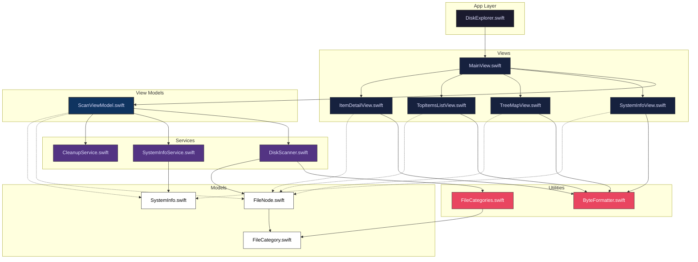

# Code Architecture Diagram

Here is a pictorial guide showing how all the source files in the Disk Explorer app are linked and depend on each other. It uses the same color palette as the original technical outline.

